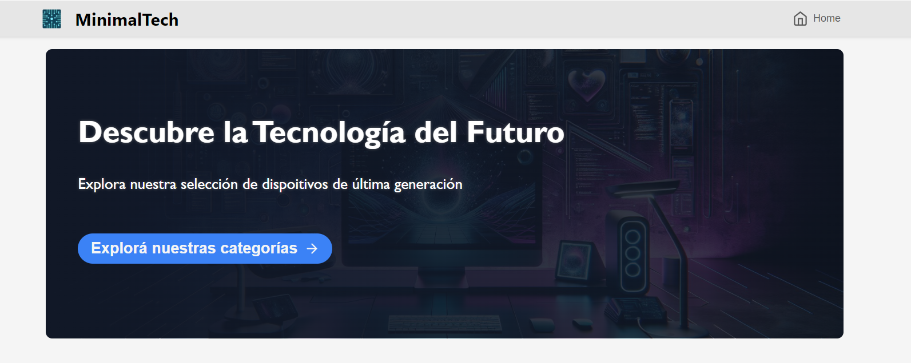
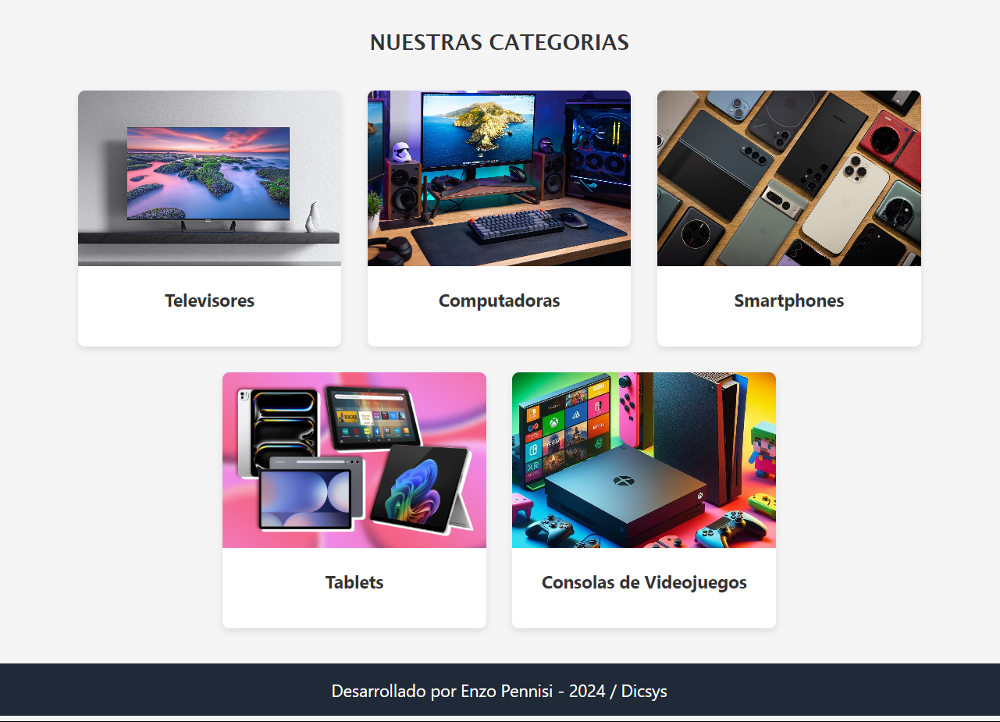

# MinimalTech: Tu E-Commerce de Tecnología

Bienvenido a **MinimalTech**, un e-commerce enfocado en la venta de productos tecnológicos. Este proyecto está diseñado para ofrecer una experiencia simple, moderna y eficiente tanto para los usuarios como para los administradores de la plataforma.  

## Descripción  

MinimalTech es una plataforma web que permite a los usuarios explorar productos tecnológicos, agregarlos al carrito de compras y finalizar su compra de manera rápida. Además, los administradores pueden gestionar la base de productos a través de operaciones CRUD.  

El proyecto cuenta con:  
- Un **frontend** desarrollado con **Angular**.  
- Un **backend** construido con **Node.js** y **Express**.  
- Gestión de datos mediante **MySQL**.

---

## Funcionalidades  

- Navegar entre categorías de productos.  
- Ver detalles de cada producto.
- Crear, editar y eliminar productos desde un formulario. 

---

## Tecnologías Principales  

- **Frontend:** Angular con Angular Router y HttClient.  
- **Backend:** Node.js, Express.  
- **Base de datos:** MySQL.  

---

## Vista previa de la página
  
 
