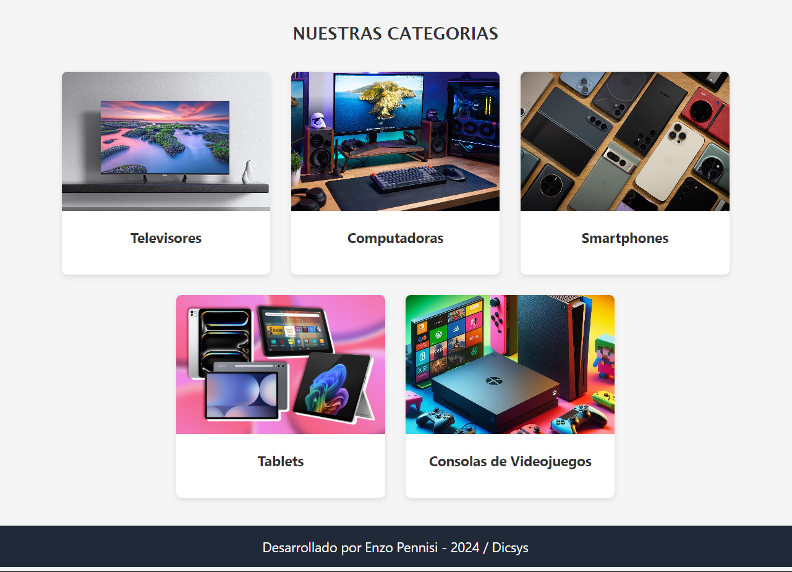
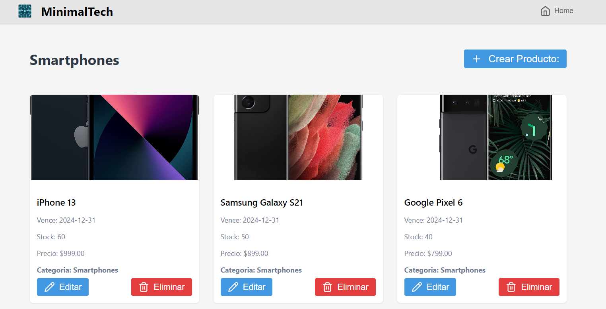

# MinimalTech: E-Commerce de Tecnología

**MinimalTech** es un e-commerce enfocado en productos tecnológicos. Este proyecto está diseñado para ofrecer una experiencia simple, moderna y eficiente.

El proyecto cuenta con:  
- Un **frontend** desarrollado con **Angular**.  
- Un **backend** construido con **Node.js** y **Express**.  
- Gestión de datos mediante **MySQL**.

---

## Funcionalidades  

- Navegar entre categorías de productos.  
- Ver detalles de cada producto asociado a una categoría.  
- Crear, editar y eliminar productos desde un formulario.  
- Además, cuenta con los endpoints necesarios para realizar el CRUD completo sobre las categorías.

---

## Tecnologías Principales  

- **Frontend:** Angular con Angular Router y HttpClient.  
- **Backend:** Node.js, Express.  
- **Base de datos:** MySQL.  

---

## Vista previa de la página  

### Home  
Vista inicial donde los usuarios pueden explorar las distintas categorías.  
  
  

### Productos  
Vista de los productos asociados a una categoría específica, con detalles clave.  
  
